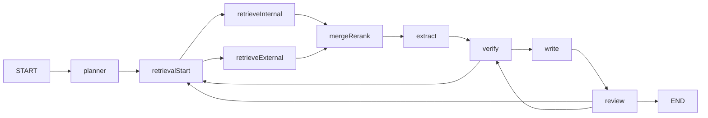

# InsightFlow 架构问答总结

这份文档整理的是我在实现 InsightFlow 时，围绕 workflow、agent、LangGraph4j、checkpoint、RAG 和回退路由做出的设计说明。
它的目标不是“问答机器人”，而是“围绕研究目标自动拆解、检索、抽取、验证、写作、审查”的调研流水线。

## 1. 这套系统到底是 workflow 还是 agent

结论很明确：**外层是 workflow，内层是 agent**。

- workflow 负责控制主流程怎么走，什么时候检索，什么时候验证，什么时候回退。
- agent 负责节点内部的智能决策，比如拆解任务、抽取事实、验证 claims、生成报告、审查报告。
- tool 负责稳定的工程能力，比如知识库检索、网页抓取、重排、引用绑定、可信度评分。

在代码里，这种分工落在 [ResearchGraphBuilder.java](../src/main/java/com/astray/insightflow/graph/ResearchGraphBuilder.java) 上：

```text
START -> planner -> retrievalSubgraph -> extract -> verify -> write -> review -> END
```

所以这个项目不是“让 LLM 自己决定全流程”，而是“图来管流程，LLM 只在局部节点里做智能判断”。

## 2. 主图长什么样



这里面最关键的点有三个：

1. `retrievalStart` 只是一个分发节点，不是真正的检索。
2. `retrieveInternal` 和 `retrieveExternal` 是并行分支。
3. `verify` 和 `review` 都可以把流程拉回去，形成回退闭环。

## 3. LangGraph4j 在这里具体做了什么

LangGraph4j 负责的是“图执行系统”，不是“写报告本身”。它主要做四件事：

1. 定义共享状态 `ResearchState`。
2. 把节点、边、条件路由、子图串起来。
3. 在每个节点执行后，把状态落到 checkpoint。
4. 支持恢复、重跑、并行分支、子图编排。

在代码里，这些能力主要体现在：

- [ResearchGraphBuilder.java](../src/main/java/com/astray/insightflow/graph/ResearchGraphBuilder.java)
- [RetrievalSubgraphBuilder.java](../src/main/java/com/astray/insightflow/graph/subgraph/RetrievalSubgraphBuilder.java)
- [ResearchState.java](../src/main/java/com/astray/insightflow/graph/state/ResearchState.java)
- [DatabaseCheckpointSaver.java](../src/main/java/com/astray/insightflow/graph/checkpoint/DatabaseCheckpointSaver.java)
- [CheckpointService.java](../src/main/java/com/astray/insightflow/graph/checkpoint/CheckpointService.java)
- [TaskGraphExecutor.java](../src/main/java/com/astray/insightflow/graph/TaskGraphExecutor.java)

### 状态是怎么被“写入”的

每个节点执行完，不是直接改数据库，而是**返回一个 `Map<String, Object>`**。
这些键会按 `ResearchState.SCHEMA` 合并进共享状态。

- 大部分字段使用“新值覆盖旧值”。
- `metrics` 和 `timeline` 用自定义 merge，保留前后多轮信息。

这就是“写入 state”的意思：节点把结果交回图，由图把它合并进当前执行上下文。

## 4. 共享状态 `ResearchState` 每个参数的作用

| 字段 | 作用 |
|---|---|
| `taskId` | 任务唯一标识，也是线程 ID、checkpoint 关联键 |
| `userQuery` | 用户原始研究问题 |
| `language` | 输出语言，默认中文 |
| `plan` | Planner 生成的结构化研究计划 |
| `subQueries` | Planner 拆出来的子查询 |
| `needExternalSearch` | 是否需要外部网页补证据 |
| `internalEvidences` | 内部知识库召回证据 |
| `externalEvidences` | 外部网页召回证据 |
| `mergedEvidences` | 内外证据合并并重排后的结果 |
| `facts` | Extractor 抽取出的结构化事实 |
| `claims` | Verifier 组织和校验后的 claims |
| `verifyDecision` | 验证阶段给出的路由决策 |
| `reportDraft` | Writer 生成的报告草稿 |
| `reviewResult` | Reviewer 审查结果 |
| `loopCount` | 回退循环次数 |
| `status` | 当前任务状态 |
| `metrics` | token、召回数、引用覆盖率等指标 |
| `timeline` | 节点执行轨迹 |

一句话理解：**状态就是整条图的共享上下文，也是 checkpoint 里最核心的东西。**

## 5. 每个节点具体怎么发挥作用

### PlannerNode

职责：把用户问题拆成可执行的研究计划。

- 输入：`userQuery`、`language`
- 输出：`plan`、`subQueries`、`needExternalSearch`、`loopCount=0`、`status=PLANNED`
- 副作用：保存 `task_plan`，写执行日志，发进度事件

它是整条链路的起点，决定后面要不要走外部网页检索。

在实现上，`PlannerNode` 还会：

- 调用 `PlannerAgent` 生成结构化 `PlanResult`
- 用 `PlannerPlanTemplates.normalize(...)` 做模板归一化
- 将 plan 写入数据库
- 初始化 `metrics` 和 `timeline`

### RetrievalDispatchNode

职责：只做检索分发，不做检索本身。

- 根据 `needExternalSearch` 决定是否开启双分支
- 产出 `parallelBranches`
- 更新 `status=RETRIEVAL_DISPATCHED`

它的价值是把“要不要并行检索”从检索逻辑里拆出来，图结构更清楚。

### RetrieveInternalNode

职责：检索内部知识库。

- 输入：`subQueries`
- 调用：`KbSearchTool.search(...)`
- 输出：`internalEvidences`
- 副作用：记录召回数、写日志、发进度

它解决的是“先看自己有没有存量知识”的问题。

### RetrieveExternalNode

职责：补外部网页证据。

- 输入：`subQueries`、`needExternalSearch`
- 调用：`WebSearchTool.search(...)`
- 输出：`externalEvidences`

它承担时效性和开放域补证据的职责。

### MergeRerankNode

职责：合并内外证据，再做相关性重排。

- 输入：`internalEvidences`、`externalEvidences`
- 调用：`RerankTool.rerank(...)`
- 输出：`mergedEvidences`

这个节点很关键，因为后面的抽取、验证、写作都依赖它产出的“干净证据池”。

### ExtractNode

职责：把证据变成结构化事实。

- 输入：`plan`、`mergedEvidences`
- 调用：`ExtractorAgent.extract(...)`
- 输出：`facts`
- 副作用：写入 `extracted_fact` 表

它还有一个工程兜底：如果 LLM 抽取失败或者返回空，就切换到 `StubExtractorAgent` 的启发式 fallback，再用 `FactNormalizeTool` 做标准化。

这一步的重点不是“写一段解释文本”，而是把证据加工成结构化对象，比如：

- 研究维度
- 主体
- 属性
- 取值
- 归一化值
- 对应 evidenceId
- 置信度

### VerifyNode

职责：把事实组织成 claims，做多来源校验和冲突检测。

- 输入：`facts`、`mergedEvidences`、`loopCount`
- 调用：`VerifierAgent.verify(...)`
- 之后再调用：`CitationTool`、`TrustScoreTool`
- 输出：`claims`、`verifyDecision`、`loopCount`、`status`

它会综合这些条件判断是否进入写作：

- claim 数量是否足够
- 平均置信度是否达标
- 引用覆盖率是否足够
- 冲突 claim 是否为 0

如果不够，就建议回到检索；如果循环次数超限，就进入低置信度写作模式，避免无限循环。

### WriteNode

职责：基于已验证 claims 生成报告草稿。

- 输入：`plan`、`claims`、`mergedEvidences`
- 调用：`WriterAgent.write(...)`
- 输出：`reportDraft`
- 副作用：保存报告草稿

这一步输出的不只是正文，而是结构化的报告草稿，后续还能被审查节点修改。

### ReviewNode

职责：检查报告是否能交付。

- 输入：`reportDraft`、`claims`、`mergedEvidences`、`loopCount`
- 调用：`ReviewerAgent.review(...)`
- 输出：`reviewResult`、更新后的 `reportDraft`、`loopCount`

如果审查认为证据还不够，就给出回退目标：

- 回退到 `retrieval`，继续补证据
- 回退到 `verify`，重新做验证
- 或者通过后直接结束

## 6. 条件路由是怎么做的

### VerifyRouteDecider

它决定 `verify` 后往哪走：

- `readyForWrite = true` -> 进 `write`
- `loopCount > maxLoops` -> 直接进 `write`
- `rerunRetrieval = true` -> 回到 `retrievalStart`
- 其他情况 -> 进 `write`

### ReviewRouteDecider

它决定 `review` 后往哪走：

- `approved = true` -> `END`
- `rerunFrom = RETRIEVAL` -> 回到 `retrievalStart`
- `rerunFrom = VERIFY` -> 回到 `verify`
- 循环次数超限 -> `END`

这就是这个项目最重要的原则：**LLM 给建议，图来做最终路由。**

## 7. 子图和并行分支怎么跑

检索子图由 `RetrievalSubgraphBuilder` 组装：

- `retrievalStart -> retrieveInternal`
- `retrievalStart -> retrieveExternal`
- 两条分支最终都流向 `mergeRerank`

这意味着内外检索可以并行推进，最后统一汇总。

这种拆法的好处是：

- 检索策略更清楚
- 外部网页补证据不会干扰内部召回
- 后续重排前可以统一清洗证据池

## 8. checkpoint 是怎么实现的

checkpoint 的核心不是“保存节点对象”，而是**保存状态对象 `ResearchState`**。

### 8.1 图上怎么接入

在 `ResearchGraphBuilder` 里有：

```java
.checkpointSaver(checkpointSaver)
```

这里传入的是 `DatabaseCheckpointSaver` 实例，它告诉 LangGraph4j：

- 每次节点推进后要不要落盘
- 状态怎么序列化
- 恢复时从哪里读回来

### 8.2 存了什么

`graph_checkpoint_meta` 里主要存这些内容：

- `checkpointId`
- `taskId`
- `nodeName`
- `nextNodeName`
- `saveMode`
- `stateJson`
- `stateSummaryJson`
- `createdAt`
- `updatedAt`

其中最关键的是 `stateJson`，它是当前 `ResearchState` 的完整序列化结果。

### 8.3 为什么可以恢复

因为恢复并不依赖“节点实体里有没有文本”，而依赖这三样：

1. 当前 state 的完整快照
2. 上次执行到哪个节点
3. 下一步应该从哪个节点继续

所以只要节点把结果写进 state，checkpoint 就能把它恢复回来。

### 8.4 恢复逻辑是什么

`CheckpointService` 会负责找到要恢复的快照：

- `latest(taskId)`：恢复最近一次
- `get(taskId, checkpointId)`：按 checkpoint 精确恢复
- `snapshotBeforeNode(taskId, nodeName)`：按节点回退

然后 `TaskGraphExecutor` 会构造 `RunnableConfig`：

- `threadId = taskId`
- `checkPointId = checkpointId`
- `nextNode = nextNodeName`

最后调用：

```java
compiledGraph.invoke((Map<String, Object>) null, runnableConfig)
```

这时图会从 checkpoint 继续往下跑，而不是从头开始。

### 8.5 什么时候用 resume，什么时候用 rerun

- `resume`：任务中断后继续跑。
- `rerun`：指定某个节点重新跑一遍。

`resume` 用最新 checkpoint，`rerun` 用“某节点之前的 checkpoint”。

## 9. 一个最典型的执行链路

1. 用户提交任务。
2. `PlannerNode` 拆解问题，生成 `PlanResult`。
3. 检索子图先做内部检索，再视情况补外部网页。
4. `MergeRerankNode` 汇总证据。
5. `ExtractNode` 抽取结构化 facts。
6. `VerifyNode` 校验 claims 并决定是否补证据。
7. `WriteNode` 生成报告草稿。
8. `ReviewNode` 审查报告，并决定结束、回退或重跑。
9. 每一步都会产出 checkpoint，任务可恢复、可重跑、可人工介入。

## 10. 这套设计的实际价值

- 流程稳定，避免 LLM 直接控制全局。
- 节点职责单一，方便调试和替换。
- 内部知识库和外部网页可以混合检索。
- facts -> claims -> report 的链条是可追踪的。
- checkpoint 让长任务可恢复，这一点很适合调研类项目。

一句话总结：

**InsightFlow 的核心不是“会聊天”，而是“能围绕研究目标跑完整个取证、验证、写作、审查闭环”。**

