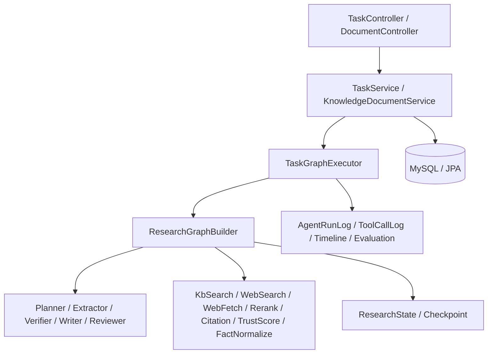

# InsightFlow 源码阅读路线图

这份文档不是架构宣传稿，而是给你按源码阅读用的导读。  
如果你的目标是“完全搞懂这个项目的所有代码、逻辑、表设计和执行链路”，建议你按这里的顺序读。

配套参考：
- [架构问答总结](./insightflow-architecture-qa.md)

## 1. 先建立总图

InsightFlow 的主线很简单：

`TaskController -> TaskService -> TaskGraphExecutor -> ResearchGraphBuilder -> Nodes/Agents/Tools -> DB/Checkpoint/Report/Eval`

你要先记住三个原则：

1. 外层是 workflow，负责流程顺序和回退。
2. 内层是 agent，负责局部智能决策。
3. state + checkpoint 贯穿全局，保证可恢复、可重跑、可审查。

建议你先把下面这张图记住：

## 2. 最推荐的阅读顺序

### 第 1 层：启动和配置

先读这些文件：

- [InsightFlowApplication.java](../src/main/java/com/astray/insightflow/InsightFlowApplication.java)
- [application.yml](../src/main/resources/application.yml)
- [application-postgres.yml](../src/main/resources/application-postgres.yml)
- [LangChainConfig.java](../src/main/java/com/astray/insightflow/config/LangChainConfig.java)
- [GraphRuntimeConfig.java](../src/main/java/com/astray/insightflow/config/GraphRuntimeConfig.java)
- [WorkflowProperties.java](../src/main/java/com/astray/insightflow/config/WorkflowProperties.java)
- [AgentProperties.java](../src/main/java/com/astray/insightflow/config/AgentProperties.java)
- [RagProperties.java](../src/main/java/com/astray/insightflow/config/RagProperties.java)
- [InfrastructureProperties.java](../src/main/java/com/astray/insightflow/config/InfrastructureProperties.java)

你要先看懂：

- 用了什么模型，怎么切换真实 LLM 和 stub agent。
- 数据库、知识库路径、模型 baseUrl、API Key、workflow 阈值从哪里来。
- 为什么 `glm-5`、`DB_*`、`OPENAI_*`、`INSIGHTFLOW_*` 都是环境变量驱动。

### 第 2 层：任务入口

先读这些文件：

- [TaskController.java](../src/main/java/com/astray/insightflow/task/api/TaskController.java)
- [TaskService.java](../src/main/java/com/astray/insightflow/task/service/TaskService.java)
- [ResearchTask.java](../src/main/java/com/astray/insightflow/task/domain/ResearchTask.java)
- [TaskPlanEntity.java](../src/main/java/com/astray/insightflow/task/domain/TaskPlanEntity.java)
- [ResearchTaskStatus.java](../src/main/java/com/astray/insightflow/task/domain/ResearchTaskStatus.java)

你要看懂：

- 一个任务从 `create` 到 `run` 到 `resume/rerun/evaluate` 的入口在哪里。
- 任务本身只存“研究问题、语言、状态、时间戳、错误信息”。
- 计划单独存在 `task_plan`，不是直接塞进任务表。

### 第 3 层：知识库和检索

先读这些文件：

- [DocumentController.java](../src/main/java/com/astray/insightflow/knowledge/api/DocumentController.java)
- [KnowledgeDocumentService.java](../src/main/java/com/astray/insightflow/knowledge/service/KnowledgeDocumentService.java)
- [KnowledgeDocument.java](../src/main/java/com/astray/insightflow/knowledge/domain/KnowledgeDocument.java)
- [DocumentChunk.java](../src/main/java/com/astray/insightflow/knowledge/domain/DocumentChunk.java)
- [InternalRetrievalService.java](../src/main/java/com/astray/insightflow/retrieval/service/InternalRetrievalService.java)
- [ExternalRetrievalService.java](../src/main/java/com/astray/insightflow/retrieval/service/ExternalRetrievalService.java)
- [Evidence.java](../src/main/java/com/astray/insightflow/retrieval/model/Evidence.java)
- [EvidenceRecord.java](../src/main/java/com/astray/insightflow/retrieval/domain/EvidenceRecord.java)
- [EvidenceSourceType.java](../src/main/java/com/astray/insightflow/retrieval/domain/EvidenceSourceType.java)

你要看懂：

- 文档上传后，原文放哪儿，chunk 怎么切。
- 内部检索现在是怎么打分的，为什么它不是纯向量检索。
- 外部检索怎么搜、怎么抓网页、怎么去重、怎么过滤低质量结果。
- Evidence 为什么要单独落表，因为后面的抽取、验证、报告都依赖它。

### 第 4 层：图编排和状态

先读这些文件：

- [ResearchState.java](../src/main/java/com/astray/insightflow/graph/state/ResearchState.java)
- [ResearchStateFactory.java](../src/main/java/com/astray/insightflow/graph/state/ResearchStateFactory.java)
- [ResearchGraphBuilder.java](../src/main/java/com/astray/insightflow/graph/ResearchGraphBuilder.java)
- [RetrievalSubgraphBuilder.java](../src/main/java/com/astray/insightflow/graph/subgraph/RetrievalSubgraphBuilder.java)
- [PlannerNode.java](../src/main/java/com/astray/insightflow/graph/node/PlannerNode.java)
- [RetrievalDispatchNode.java](../src/main/java/com/astray/insightflow/graph/node/RetrievalDispatchNode.java)
- [RetrieveInternalNode.java](../src/main/java/com/astray/insightflow/graph/node/RetrieveInternalNode.java)
- [RetrieveExternalNode.java](../src/main/java/com/astray/insightflow/graph/node/RetrieveExternalNode.java)
- [MergeRerankNode.java](../src/main/java/com/astray/insightflow/graph/node/MergeRerankNode.java)
- [ExtractNode.java](../src/main/java/com/astray/insightflow/graph/node/ExtractNode.java)
- [VerifyNode.java](../src/main/java/com/astray/insightflow/graph/node/VerifyNode.java)
- [WriteNode.java](../src/main/java/com/astray/insightflow/graph/node/WriteNode.java)
- [ReviewNode.java](../src/main/java/com/astray/insightflow/graph/node/ReviewNode.java)
- [InternalRouteDecider.java](../src/main/java/com/astray/insightflow/graph/router/InternalRouteDecider.java)
- [VerifyRouteDecider.java](../src/main/java/com/astray/insightflow/graph/router/VerifyRouteDecider.java)
- [ReviewRouteDecider.java](../src/main/java/com/astray/insightflow/graph/router/ReviewRouteDecider.java)
- [DatabaseCheckpointSaver.java](../src/main/java/com/astray/insightflow/graph/checkpoint/DatabaseCheckpointSaver.java)
- [CheckpointService.java](../src/main/java/com/astray/insightflow/graph/checkpoint/CheckpointService.java)
- [GraphCheckpointMeta.java](../src/main/java/com/astray/insightflow/graph/checkpoint/GraphCheckpointMeta.java)

你要看懂：

- `ResearchState` 为什么是整个图的共享上下文。
- 每个节点执行完为什么返回 `Map<String, Object>`，而不是直接改数据库。
- `planner -> retrieval -> extract -> verify -> write -> review` 为什么是主流程。
- `retrievalStart` 为什么只是分发节点，真正检索在子图里。
- `verify` 和 `review` 为什么都能回退，回退条件由谁决定。
- checkpoint 保存的不是“节点对象”，而是“状态快照 + 下一节点”。

### 第 5 层：Agent 和提示词

先读这些文件：

- [PlannerAgent.java](../src/main/java/com/astray/insightflow/agent/planner/PlannerAgent.java)
- [ExtractorAgent.java](../src/main/java/com/astray/insightflow/agent/extractor/ExtractorAgent.java)
- [VerifierAgent.java](../src/main/java/com/astray/insightflow/agent/verifier/VerifierAgent.java)
- [WriterAgent.java](../src/main/java/com/astray/insightflow/agent/writer/WriterAgent.java)
- [ReviewerAgent.java](../src/main/java/com/astray/insightflow/agent/reviewer/ReviewerAgent.java)
- `src/main/resources/prompts/*.txt`
- [PlanResult.java](../src/main/java/com/astray/insightflow/agent/planner/PlanResult.java)
- [ExtractResult.java](../src/main/java/com/astray/insightflow/agent/extractor/ExtractResult.java)
- [VerificationResult.java](../src/main/java/com/astray/insightflow/agent/verifier/VerificationResult.java)
- [ReportDraft.java](../src/main/java/com/astray/insightflow/agent/writer/ReportDraft.java)
- [ReviewResult.java](../src/main/java/com/astray/insightflow/agent/reviewer/ReviewResult.java)

你要看懂：

- LangChain4j 的 `@SystemMessage` / `@UserMessage` / `@V` 怎么把参数喂给模型。
- 为什么所有 agent 都返回结构化对象，而不是裸文本。
- stub agent 在没有真实 API Key 时怎么兜底。
- prompt 文件里每个字段和返回结构如何对应。

### 第 6 层：报告、观测和评测

先读这些文件：

- [ReportService.java](../src/main/java/com/astray/insightflow/report/service/ReportService.java)
- [FinalReport.java](../src/main/java/com/astray/insightflow/report/domain/FinalReport.java)
- [AgentRunLogService.java](../src/main/java/com/astray/insightflow/observe/service/AgentRunLogService.java)
- [ToolCallLogService.java](../src/main/java/com/astray/insightflow/observe/service/ToolCallLogService.java)
- [TaskTimelineService.java](../src/main/java/com/astray/insightflow/observe/service/TaskTimelineService.java)
- [TaskProgressPublisher.java](../src/main/java/com/astray/insightflow/task/service/TaskProgressPublisher.java)
- [EvaluationService.java](../src/main/java/com/astray/insightflow/eval/service/EvaluationService.java)
- [EvaluationRecord.java](../src/main/java/com/astray/insightflow/eval/domain/EvaluationRecord.java)

你要看懂：

- 报告草稿怎么变成 markdown 和 JSON。
- 执行日志、工具调用日志、SSE 进度流、时间线是怎么拼起来的。
- 评测不是只看“有没有答案”，而是看检索命中、引用覆盖、claim 支撑、报告完整度。

### 第 7 层：前端

最后再读：

- [index.html](../src/main/resources/static/index.html)
- [app.js](../src/main/resources/static/app.js)
- [styles.css](../src/main/resources/static/styles.css)

你要看懂：

- 前端只是一个控制台，不是业务核心。
- 它怎么调用 `/api/tasks`、`/api/documents`、`/stream`、`/timeline`、`/checkpoints`、`/evaluate`。
- 为什么它要维护任务选择、文档选择、恢复点、实时流和预览面板。

## 3. 表设计应该怎么读

你可以把数据库表分成 5 类：

### 任务主表

- `research_task`
- `task_plan`

它们负责“任务是谁、要研究什么、当前状态如何、计划是什么”。

### 知识库表

- `knowledge_document`
- `document_chunk`

它们负责“上传了什么文档、文档被切成了哪些 chunk”。

### 证据和中间结果表

- `evidence_record`
- `extracted_fact`
- `verified_claim`

它们负责“检索到什么、抽出了什么事实、验证成了什么 claims”。

### 结果表

- `final_report`

它们负责“最终报告是什么”。

### 过程和恢复表

- `agent_run_log`
- `tool_call_log`
- `graph_checkpoint_meta`
- `evaluation_record`

它们负责“过程看得见、恢复做得到、评测能量化”。

### 你读表时要盯住的字段

- 主键是谁。
- 哪些字段是 `taskId` 外键语义。
- 哪些字段是 JSON 字符串，哪些是真结构化列。
- 哪些表是一条任务一条记录，哪些表是一条任务多条记录。

## 4. 一次完整任务的执行链

你可以按下面这条链路对照代码：

1. `POST /api/tasks` 创建任务。
2. `POST /api/tasks/{id}/run` 启动图执行。
3. `PlannerNode` 生成 `PlanResult`，写入 `task_plan`。
4. `RetrievalDispatchNode` 决定内部/外部检索怎么跑。
5. `RetrieveInternalNode` / `RetrieveExternalNode` 召回证据并落到 `evidence_record`。
6. `MergeRerankNode` 合并证据并重排。
7. `ExtractNode` 抽出 `facts`，落到 `extracted_fact`。
8. `VerifyNode` 生成 `claims` 和 `verifyDecision`，落到 `verified_claim`。
9. `WriteNode` 生成 `reportDraft`，落到 `final_report`。
10. `ReviewNode` 产出 `reviewResult`，决定通过、回退或重跑。
11. `DatabaseCheckpointSaver` 在每个节点后保存 `graph_checkpoint_meta`。
12. `TaskTimelineService` 把日志、checkpoint、评测、证据统一给前端查看。

## 5. checkpoint 和恢复你要重点理解什么

这部分很关键，建议单独读。

### 保存了什么

`graph_checkpoint_meta` 里最重要的是：

- `checkpointId`
- `taskId`
- `nodeName`
- `nextNodeName`
- `stateJson`
- `stateSummaryJson`

真正能恢复的是 `stateJson`，它是 `ResearchState` 的完整快照。

### 为什么能恢复

因为恢复的核心不是“补回节点对象”，而是：

1. 把状态反序列化回来。
2. 找到下一步节点。
3. 继续往下执行。

### 怎么区分用哪个 checkpoint

- `resume`：用最新 checkpoint 或指定 checkpoint。
- `rerun`：找“目标节点之前”的 checkpoint。
- `beforeNode`：给前端预览某节点之前的状态。

### 你要特别看懂的三个问题

- 哪些结果被写进了 `ResearchState`。
- 哪些结果只存数据库，不进 state。
- 哪些字段是为了恢复，哪些字段只是为了展示。

## 6. 读这个项目时最容易卡住的地方

1. 你会把 agent 当成 workflow。其实不是，workflow 在外，agent 在内。
2. 你会把 checkpoint 当成节点历史。其实它保存的是 state 快照。
3. 你会以为检索结果一定要是向量库。其实当前内部检索是 chunk 词项打分，向量配置是扩展点。
4. 你会以为所有结果都写数据库。其实很多中间结果先写进 state，再由 checkpoint 承接。
5. 你会以为 LLM 决定整个流程。其实真正的路由是 `VerifyRouteDecider` / `ReviewRouteDecider`。

## 7. 建议你边读边回答的 10 个问题

- 任务从哪一个 Controller 进入？
- 任务状态是谁改的？
- 计划是谁生成的？
- 检索结果为什么要分内部和外部？
- 什么时候会触发回退？
- `facts -> claims -> report` 的转换在哪些节点完成？
- 哪些内容会进入 `ResearchState`？
- checkpoint 为什么能恢复？
- 哪些内容是为了观测，哪些内容是为了业务？
- 前端页面的每个面板对应后端哪个接口？

如果你能把这 10 个问题都顺着源码回答出来，这个项目就基本被你吃透了。

